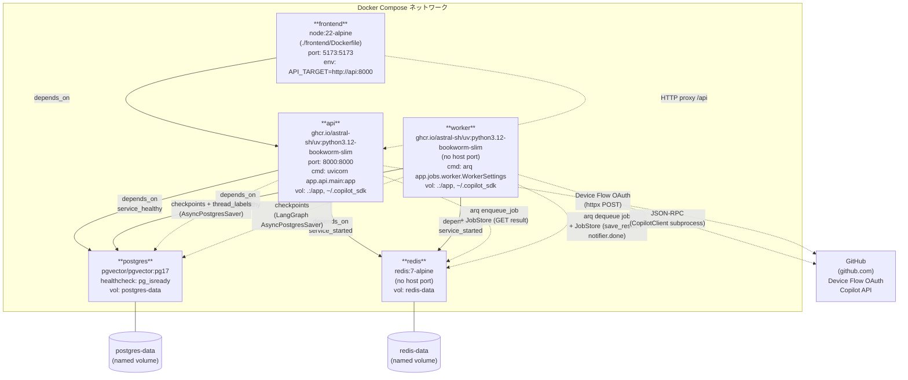

# プロセス構成図 — Copilot LangGraph Chat

このドキュメントは、`docker-compose.yml` で定義されたサービス構成をMermaidフローチャートで表現したものです。

5つのサービス（frontend, api, worker, redis, postgres）の依存関係、公開ポート、ボリューム、データフローを示します。

---

## Docker Compose サービストポロジー

---

## サービス詳細

| サービス | イメージ | ホストポート | 主な役割 |
|---------|---------|------------|---------|
| `frontend` | `node:22-alpine` (Dockerfile build) | 5173 | Vite dev server、`/api` を api コンテナへプロキシ |
| `api` | `uv:python3.12-bookworm-slim` | 8000 | FastAPI: chat/auth/job/me エンドポイント、arqジョブエンキュー、SSE |
| `worker` | `uv:python3.12-bookworm-slim` | なし | arq ワーカー: LangGraph実行、ChatCopilot呼び出し、結果保存 |
| `redis` | `redis:7-alpine` | なし(内部のみ) | arqジョブキュー + JobStore（ジョブ結果・done通知） |
| `postgres` | `pgvector/pgvector:pg17` | なし(内部のみ) | LangGraphチェックポイント + thread_labelsテーブル |
