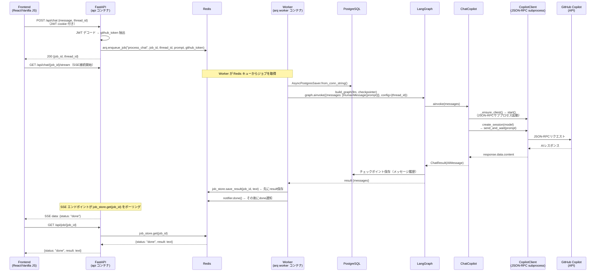
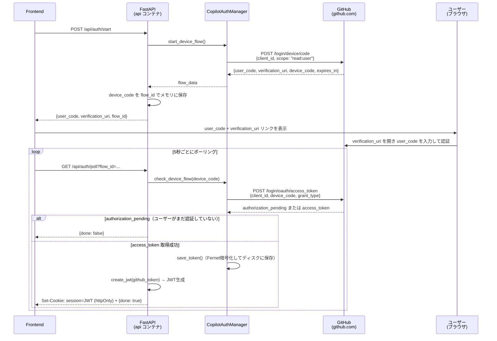

# シーケンス図 — Copilot LangGraph Chat

このドキュメントは、システムの主要な2つのフローをMermaidシーケンス図で表現したものです。

1. **チャットメッセージフロー** — ユーザーがメッセージを送信してAIレスポンスが返るまでの非同期ジョブキューフロー
2. **GitHub Device Flow 認証フロー** — 初回ログイン時のOAuth認証フロー

---

## 1. チャットメッセージフロー（メッセージ送信〜AIレスポンス返却）

---

## 2. GitHub Device Flow 認証フロー（初回ログイン）

